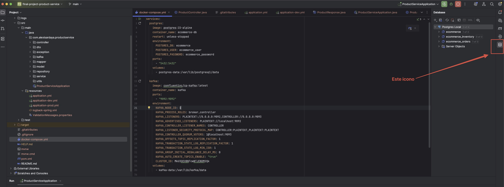
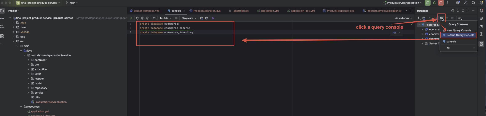
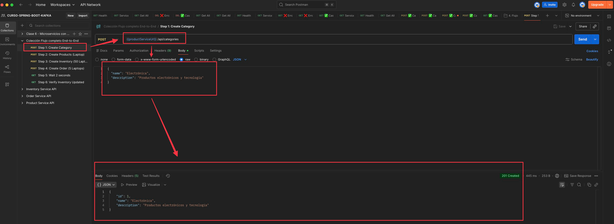
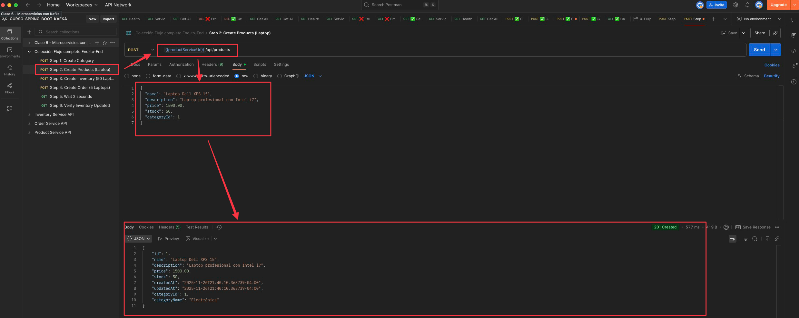
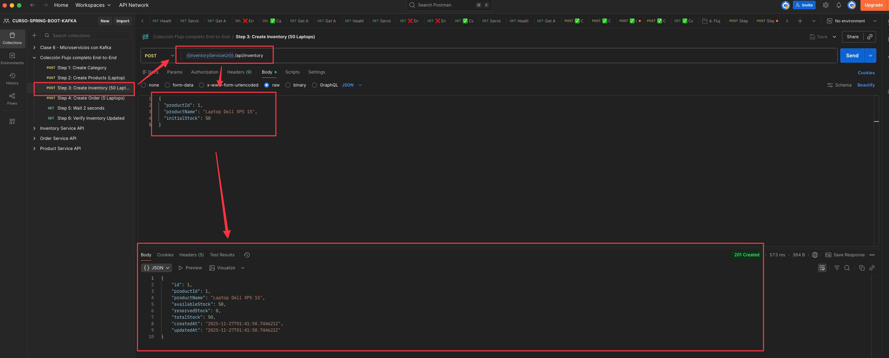
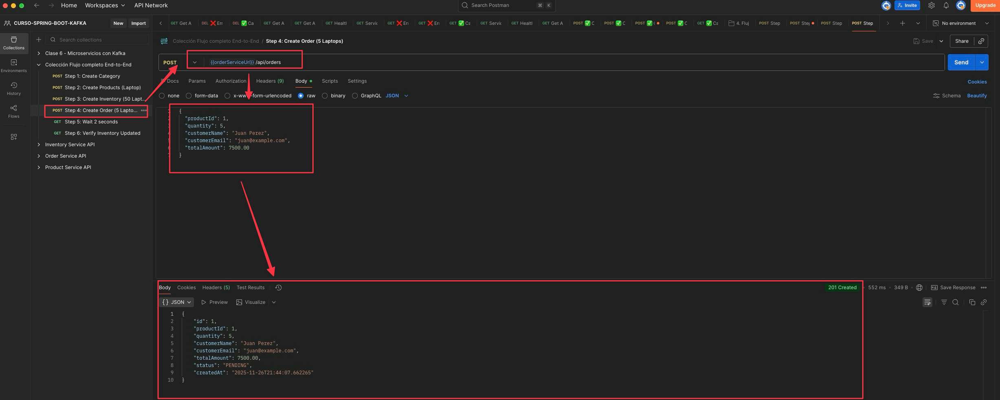
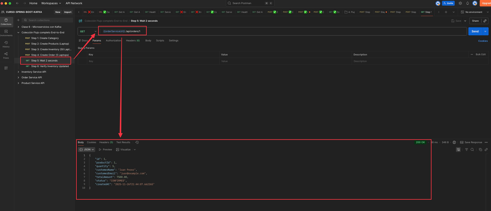
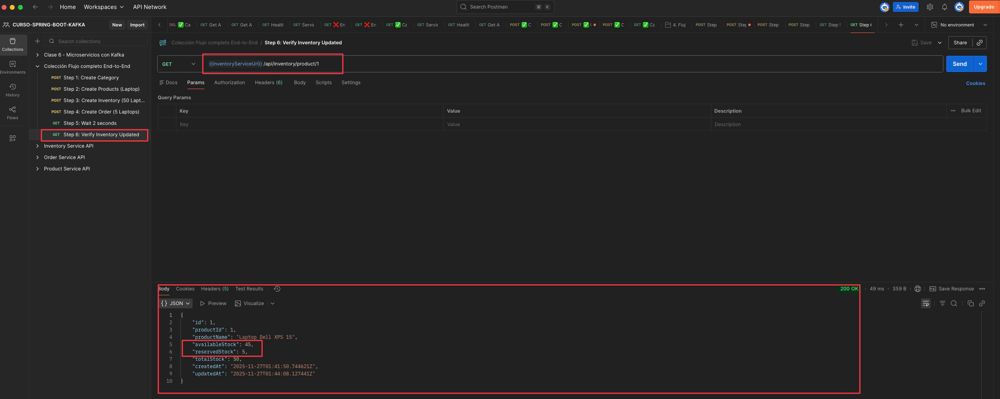

# Proyecto Final - Curso Spring Boot Kafka

Proyecto final del curso de Spring Boot y Kafka que implementa una arquitectura de microservicios para un sistema de gestión de pedidos, productos e inventario.

## 📋 Descripción

Este proyecto consiste en una arquitectura de microservicios distribuida que utiliza Apache Kafka como sistema de mensajería para la comunicación asíncrona entre servicios. El sistema permite gestionar productos, inventario y pedidos de manera desacoplada y escalable.

## 🏗️ Arquitectura

El proyecto está compuesto por tres microservicios principales que se comunican mediante eventos a través de Apache Kafka:

- **Product Service**: Gestiona el catálogo de productos
- **Order Service**: Maneja la creación y gestión de pedidos
- **Inventory Service**: Controla el inventario y disponibilidad de productos

## 🔗 Microservicios

### 1. Product Service
**Repositorio**: [final-project-product-service](https://github.com/AlexisArdaya09/final-project-product-service)

Servicio encargado de la gestión del catálogo de productos. Proporciona operaciones CRUD para productos y categorías, y publica eventos relacionados con cambios en el catálogo.

### 2. Order Service
**Repositorio**: [final-project-order-service](https://github.com/AlexisArdaya09/final-project-order-service)

Servicio que gestiona el ciclo de vida de los pedidos. Crea pedidos, valida disponibilidad de productos y coordina con otros servicios mediante eventos de Kafka.

### 3. Inventory Service
**Repositorio**: [final-project-inventory-service](https://github.com/AlexisArdaya09/final-project-inventory-service)

Servicio responsable del control de inventario. Gestiona el stock de productos, actualiza disponibilidad.

## 🛠️ Stack Tecnológico

- **Java** - Lenguaje de programación
- **Spring Boot** - Framework de desarrollo
- **Apache Kafka** - Sistema de mensajería y streaming
- **Spring Cloud** - Herramientas para microservicios (opcional)
- **Maven/Gradle** - Gestión de dependencias
- **Docker** - Containerización (opcional)

## 📦 Prerrequisitos

Antes de comenzar, asegúrate de tener instalado:

- Java 17.0.9
- Maven 3.9.11
- IDE: IntelliJ IDEA Ultimate
- Git
- Docker Desktop

## 🚀 Inicio del Proyecto

Sigue estos pasos para configurar y ejecutar el proyecto correctamente:

### 1. Levantar Infraestructura con Docker Compose

Desde este repositorio principal, ejecuta Docker Compose para levantar PostgreSQL y Kafka:

```bash
docker-compose up -d
```

Esto iniciará:
- **PostgreSQL**: Base de datos para los microservicios
- **Apache Kafka**: Sistema de mensajería para comunicación entre servicios

### 2. Crear las Bases de Datos

Una vez que los contenedores estén en ejecución, crea las bases de datos necesarias:

```sql
-- Conectarse a PostgreSQL (puedes usar pgAdmin, DBeaver o psql)
-- O ejecutar desde el contenedor de PostgreSQL

-- Base de datos para Product Service
CREATE DATABASE ecommerce;

-- Base de datos para Order Service
CREATE DATABASE ecommerce_orders;

-- Base de datos para Inventory Service
CREATE DATABASE ecommerce_inventory;
```

**Nota**: Puedes ejecutar estos comandos SQL desde tu cliente de PostgreSQL preferido o desde el contenedor:

```bash
docker exec -it <nombre_contenedor_postgres> psql -U <usuario> -c "CREATE DATABASE ecommerce;"
docker exec -it <nombre_contenedor_postgres> psql -U <usuario> -c "CREATE DATABASE ecommerce_orders;"
docker exec -it <nombre_contenedor_postgres> psql -U <usuario> -c "CREATE DATABASE ecommerce_inventory;"
```

O tambien puedes hacerlo desde  IDE: IntelliJ IDEA Ultimate, sigue los siguientes pasos:

- En la parte derecha ubica el icono de las bases de datos
   

- Luego click en query console
    

- Ejecuta los siguientes comandos para crear las bases de datos
```sql
-- Conectarse a PostgreSQL (puedes usar pgAdmin, DBeaver o psql)
-- O ejecutar desde el contenedor de PostgreSQL

-- Base de datos para Product Service
CREATE DATABASE ecommerce;

-- Base de datos para Order Service
CREATE DATABASE ecommerce_orders;

-- Base de datos para Inventory Service
CREATE DATABASE ecommerce_inventory;
```
### 3. Ejecutar los Microservicios

Para poder levantar correctamente los microservicios, iniciaremos con **Product Service** y luego seguiremos con los demás servicios en orden. Cada microservicio tiene su propio README con instrucciones detalladas.

#### 3.1. Product Service

- Ve al repositorio de [Product Service](https://github.com/AlexisArdaya09/final-project-product-service)
- Allí encontrarás las instrucciones específicas para levantar el servicio
- Sigue los pasos indicados en su README

#### 3.2. Inventory Service

- Ve al repositorio de [Inventory Service](https://github.com/AlexisArdaya09/final-project-inventory-service)
- Allí encontrarás las instrucciones específicas para levantar el servicio
- Sigue los pasos indicados en su README

#### 3.3. Order Service

- Ve al repositorio de [Order Service](https://github.com/AlexisArdaya09/final-project-order-service)
- Allí encontrarás las instrucciones específicas para levantar el servicio
- Sigue los pasos indicados en su README

### 4. Importar Colecciones de Postman

Para probar los endpoints de cada microservicio, puedes importar las colecciones de Postman. Dispones de dos opciones:

**Instrucciones**:
1. Haz clic en el enlace anterior
2. Se abrirá Postman y podrás importar la colección completa directamente
3. La colección incluye todos los endpoints de los tres microservicios organizados por carpetas

**Configuración de Variables de Entorno**:

Asegúrate de configurar las siguientes variables en Postman (o en el entorno de la colección):

- `baseUrlProductService`: `http://localhost:8081`
- `baseUrlOrderService`: `http://localhost:8082`
- `baseUrlInventoryService`: `http://localhost:8083`

#### 4.1. Colecciones Individuales

Si prefieres importar las colecciones individuales desde GitHub:

##### 4.1.1. Product Service Collection

**Base URL**: `http://localhost:8081`

**Descargar**: [ProductService.postman_collection.json](https://github.com/AlexisArdaya09/final-project-product-service/blob/main/postman/ProductService.postman_collection.json)

**Instrucciones**:
1. Haz clic en el enlace anterior
2. En la página de GitHub, haz clic en el botón "Raw" para ver el contenido JSON
3. Copia la URL del archivo raw o descarga el archivo
4. En Postman, ve a **Import** → **Link** y pega la URL raw, o importa el archivo descargado

**URL Raw para importación directa**:
```
https://raw.githubusercontent.com/AlexisArdaya09/final-project-product-service/main/postman/ProductService.postman_collection.json
```

##### 4.1.2. Order Service Collection

**Base URL**: `http://localhost:8082`

**Descargar**: [OrderService.postman_collection.json](https://github.com/AlexisArdaya09/final-project-order-service/blob/main/postman/OrderService.postman_collection.json)

**Instrucciones**:
1. Haz clic en el enlace anterior
2. En la página de GitHub, haz clic en el botón "Raw" para ver el contenido JSON
3. Copia la URL del archivo raw o descarga el archivo
4. En Postman, ve a **Import** → **Link** y pega la URL raw, o importa el archivo descargado

**URL Raw para importación directa**:
```
https://raw.githubusercontent.com/AlexisArdaya09/final-project-order-service/main/postman/OrderService.postman_collection.json
```

##### 4.1.3. Inventory Service Collection

**Base URL**: `http://localhost:8083`

**Descargar**: [InventoryService.postman_collection.json](https://github.com/AlexisArdaya09/final-project-inventory-service/blob/main/postman/InventoryService.postman_collection.json)

**Instrucciones**:
1. Haz clic en el enlace anterior
2. En la página de GitHub, haz clic en el botón "Raw" para ver el contenido JSON
3. Copia la URL del archivo raw o descarga el archivo
4. En Postman, ve a **Import** → **Link** y pega la URL raw, o importa el archivo descargado

**URL Raw para importación directa**:
```
https://raw.githubusercontent.com/AlexisArdaya09/final-project-inventory-service/main/postman/InventoryService.postman_collection.json
```


### 5. Colección Flujo completo End-to-End

**Colección que contiene flujo completo** que incluye los pasos realizar todo el flujo:

🔗 [Colección Flujo completo End-to-End](https://gold-crater-384986.postman.co/workspace/CURSO-SPRING-BOOT-KAFKA~a0ed34ae-6d92-44d9-9c5e-a2fa452f42bb/folder/957491-d8604384-85c5-4e31-b703-a9f8e76a432b?action=share&creator=957491&ctx=documentation)

**Nota**: 
- Asegúrate de que los microservicios estén en ejecución antes de probar los endpoints en Postman
- Cada colección incluye ejemplos de casos exitosos y casos de error para facilitar las pruebas
- Los puertos por defecto de cada servicio son:
  - **Product Service**: `8081`
  - **Order Service**: `8082`
  - **Inventory Service**: `8083`

### 6. Ejecutar paso a paso el flujo completo End-to-End

##### 6.1. PASO 1 - Crear Categoria


##### 6.2. PASO 2 - Crear Producto


##### 6.3. PASO 3 - Agregar stock al producto


##### 6.4. PASO 4 - Crear Pedido


##### 6.5. PASO 5 - Verificar que el pedido esta Confirmado


#### 6.6. PASO 6 - Verificar stock actualizado


## 👤 Autor

**Alexis Ardaya**

## 📄 Licencia

Este proyecto es parte de un curso educativo.
